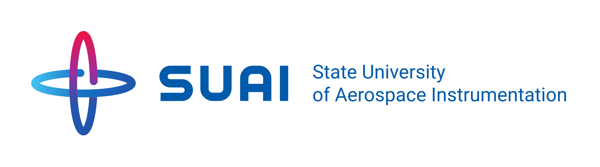

<div align="center">

    
  
  <br>

  

  # SUAI Software Engineering

  [](https://github.com/TheAndreyZakharov/SUAI-Software-Engineering/blob/study/README_RU.md)
  [](https://github.com/TheAndreyZakharov/SUAI-Software-Engineering/blob/study/README.md) 

</div>


## Description  
This repository is intended for storing student projects and reports for the program **09.03.04 — Software Engineering** (Bachelor's program, specialization: *Software Systems Design*) at the **State University of Aerospace Instrumentation**.  
It contains completed assignments and laboratory works focused on programming and software development.

Each subject in the repository has its own folder. Inside, you will find subfolders for specific assignments. These subfolders contain:  
- **Source code files** — contain the code developed as part of the assignment.  
- **Report** (`report`) — a document describing the steps taken to complete the assignment, the obtained results, and explanations.  
- **Assignment README** — a brief description and the purpose of the specific assignment.

It is important to note that only works directly related to programming and software development are included in this repository. If an assignment relates to other disciplines (for example, physics, history, philosophy, etc.), it is not uploaded, so some assignments may be missing.

Similarly, if the completion of an assignment did not require programming, development, software design, etc., such work is also not included in the repository.

## How to Use the Repository  
1. **Navigating Courses**:  
   - The root of the repository contains folders named after each subject.  
   - Open the relevant subject folder to see the list of assignments.  

2. **Navigating Assignments**:  
   - Inside each subject folder, there are subdirectories for individual tasks.  
   - Each subdirectory includes the program files, a report (`report`), and a `README` with the assignment's objectives and requirements.

3. **Reports**:  
   - For a detailed explanation of each task, check the **reports** in each assignment folder. Reports provide the main insights, methods used, and conclusions drawn from the work.  

### Example Repository Structure:

```
SUAI-Software-Engineering/
│
├── Subject_1/
│   ├── Assignment_1/
│   │   ├── main.cpp
│   │   ├── report1.pdf
│   │   └── README.md
│   └── Assignment_2/
│       ├── solution.m
│       ├── report2.pdf
│       └── README.md
│
├── Subject_2/
│   └── Assignment_3/
│       ├── main.py
│       ├── report.pdf
│       └── README.md
│
...
```


